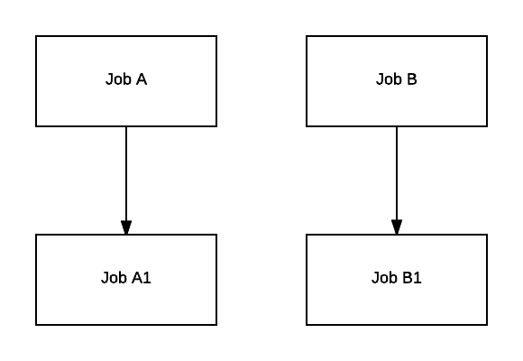
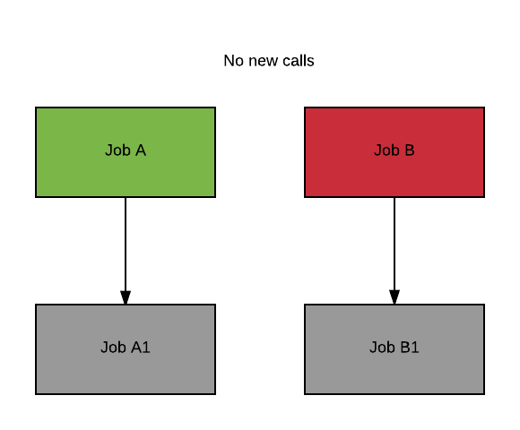
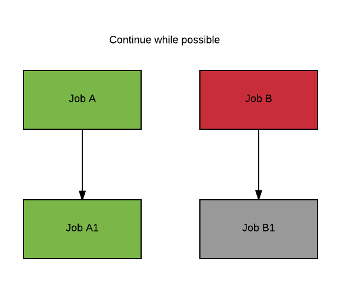
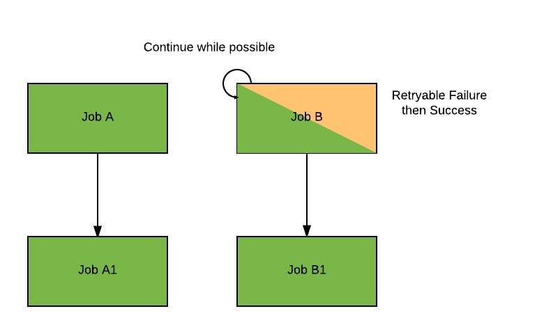
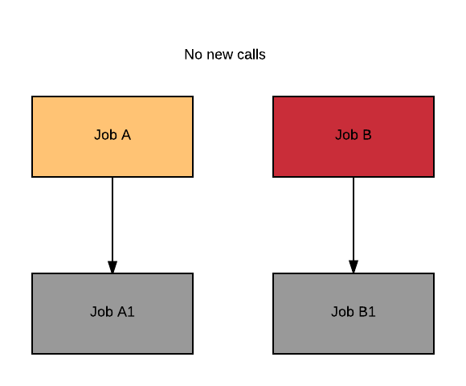
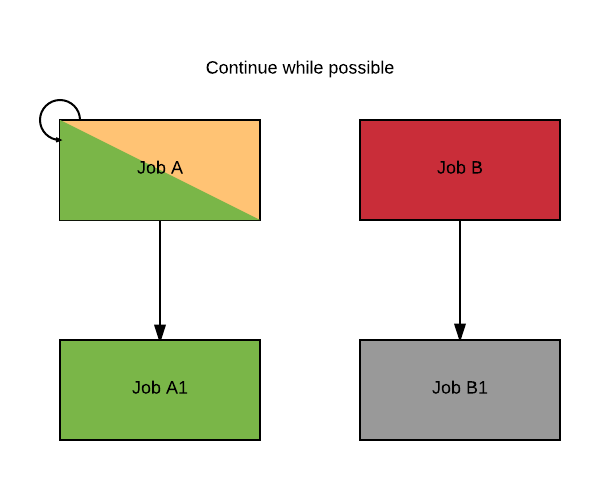

This section explains at a high level how Cromwell runs a workflow, and how workflow completeness is determined.

In order to run a workflow, Cromwell uses the backends available to it to create jobs and monitor them until they are complete. When no new jobs can or should be started, and all jobs have reached a terminal status (Success, Failure, Aborted), the workflow itself is terminated.

In an ideal situation, all jobs succeed and the workflow succeeds.
Unfortunately things don't always go as planned. Here is what to expect from Cromwell when things go off the rails.

## Failure Modes

Cromwell supports two failure modes:

* `NoNewCalls` (default)
* `ContinueWhilePossible`

They specify how Cromwell behaves when a job fails during the execution of a workflow.

`NoNewCalls` will not start any new call as soon as a job fails. Cromwell will still monitor the rest of the jobs until they complete (successfully or not).

`ContinueWhilePossible` will attempt to run as many jobs as possible until no more can be started. When all running jobs are complete, the workflow fails.

They can be set in the configuration or via the [workflow options](../wf_options/Overview#workflow-failure)

Here is an example:

This simple diagram represents 4 jobs: A and B are independent, A1 depends on A, and B1 depends on B.

Let's look at the case where A and B are both running, and for some reason B fails.

* If the failure mode is `NoNewCalls`, Cromwell will wait for A to complete, and regardless of whether it's successful or not, it will then fail the workflow, without starting A1 nor B1.

* If the failure mode is `ContinueWhilePossible` and A succeeds, then Cromwell will start A1 and wait for it to complete. At this point all jobs that can be run have been run. Indeed B1 cannot be run since B failed. Cromwell will therefore fail the workflow.

### Retryable failures

An example of a retryable failure is a preemptible VM being preempted.

Retryable failures are **not** failures that can trigger a workflow failure.
In the example above, if B's failure is retryable, then B will be retried and the workflow will keep running normally.

However, always using the previous example, if **B** fails from a **non-retryable** failure, and **A** fails from a **retryable** failure, the behavior will once again depend on the failure mode:

If the failure mode is `NoNewCalls`, then A **will not be** retried:

If the failure mode is `ContinueWhilePossible`, then A **will be** retried:

## Abort

In both Run and Server mode, you have the ability to ask Cromwell to abort a running workflow. This section explains what that entails.

When aborting a workflow, either through the [abort endpoint](api/RESTAPI#abort-a-running-workflow) or by terminating the [Cromwell run process](Modes) (if [configured](Configuring#abort) to do so), Cromwell will take the following steps:

- Change the status of the workflow to `Aborting`
- Do not start any new job going forward
- Ask every running job to abort
- Wait for all running jobs to reach completion
- Finalize the workflow
- Change the status of the workflow to `Aborted`

The action of aborting a job is backend specific. Cromwell can only ask a backend to abort a job and wait for the backend to notify it when it is in fact aborted.
Note that by the time the backend is asked to abort a job, it might already be successful, or failed, in which case Cromwell will report the job as such.

As an example, the Google backend when asked to abort a job will send an abort request to the Pipelines API. When Pipelines API indicates that the status of the job is aborted, Cromwell will mark it as such.
However the abort action is entirely dependent on the backend, in this particular case, Pipelines API does not guarantee the success of an abort request (see [Pipelines API documentation on abort](https://cloud.google.com/genomics/reference/rest/v1alpha2/operations/cancel)).

You'll also notice that the workflow is finalized even though being aborted.
Finalization is the last step in the execution of a workflow and a chance for each backend to do some work before the workflow is terminated.
Backends won't be denied the chance to finalize the workflow even if it's being aborted.

If a job fails with a retryable failure (e.g is preempted), it will **not** be attempted again when the workflow is aborting.

## Restart

When Cromwell is run in server mode, it is likely that the server will have to be stopped and started again at some point (to upgrade Cromwell to a new version for example).
In such a case, if the `workflow-restart` configuration option is set to `true` (it is by default), Cromwell will restart all jobs that were in progress.

Specifically it will attempt to reconnect to all running jobs of a workflow.
The ability to reconnect to an existing job is again backend dependent. The Google Backend and the HPC backends currently support it.

If the workflow was in state `Aborting`, Cromwell will ask all running jobs to abort again. No new job will be started.

Otherwise once all jobs have been reconnected to, the workflow will keep running normally.

During the reconnection process Cromwell might ask backends to reconnect to jobs that were never started before the restart. In that case, the job will be mark as failed with an explanation message. This failure is benign and only an artifact of the fact that Cromwell was restarted
If the backend does not support reconnection to an existing job, jobs will be marked as failed with an explanation message as well. The backend status of the jobs will be "Unknown".
